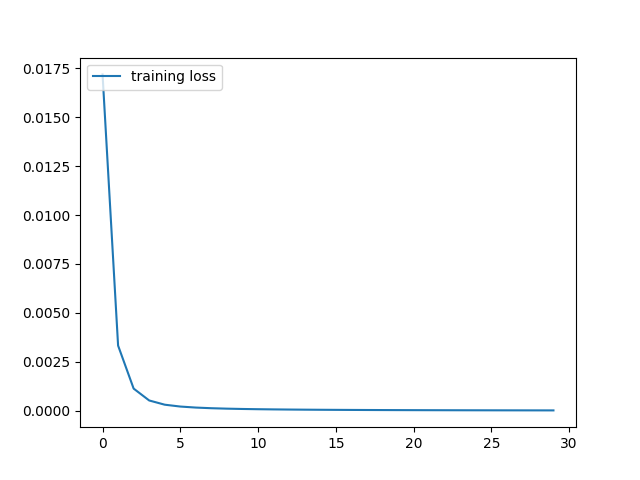

# Resnet18 with transfer learning on 102 Flowers Dataset

Trained [Pytorch Resnet18](https://github.com/pytorch/vision/blob/master/torchvision/models/resnet.py) with transfer learning on the [102 Flowers](http://www.robots.ox.ac.uk/~vgg/data/flowers/102/) dataset  
Training was done on AWS p2.xlarge ec2 instance, so that we can witness the computation power needed to train neural networks as well as the power of transfer learning  
To modify the existing resnet18 to predict 102 outputs, we change the final fc layer of the resnet to have an output of 102  

# Results
Test accuracy with 4 different transforms:  
1. Resnet18 without pretrained weights: 0.6674
2. Resnet18 with pretrained weights: 0.9570
3. Resnet with pretrained weights, but optmizing only last 2 layers 0.9609

# Model1 Graphs:
1. training loss vs epoch

2. validation loss vs epoch

3. validation acuracy vs epoch

# Model1 Graphs:
1. training loss vs epoch

2. validation loss vs epoch

3. validation acuracy vs epoch

# Model3 Graphs:
1. training loss vs epoch

2. validation loss vs epoch

3. validation acuracy vs epoch
