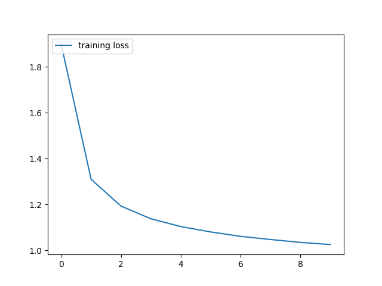
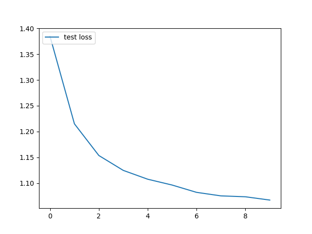
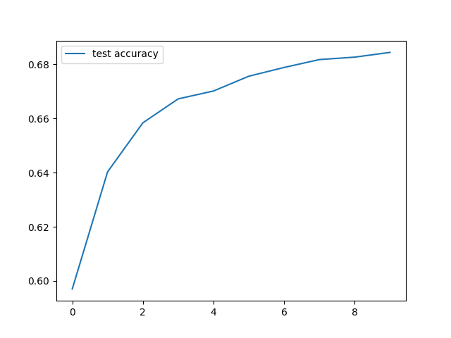

# LSTM with name dataset

Trained [Pytorch LSTM](https://github.com/pytorch/pytorch/blob/master/torch/nn/modules/rnn.py) on [Star Trek scripts dataset](https://github.com/CrimRabbit/LSTM_aws)  
We first train and test on the dataset for 10 epochs and generate at the end of each validation phase.   
The loss is calculated based on text generation of the next character in the sequence.  

# Results
The sentences generates from the last epoch were pretty good!  
IRK: What do you mean, you don't know?  
KIRK: What's the contact?  
IRK: Oh, yes.  
OR: No! No! No! No! No! No! No!  
AND: Yes, sir.  
IRK: The captain time is an order of this specimen.  
POCK: Yes, sir.  
ARA: You are the condition will get this soult.  
POCK: Captain, who are you?  
ONES: You must have the signal in a long time. I am of that you say the Captain.  
  
1. 
2. 
3. 

