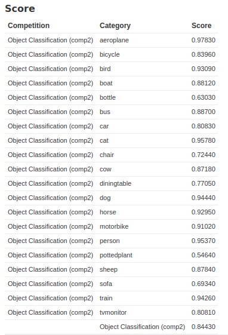
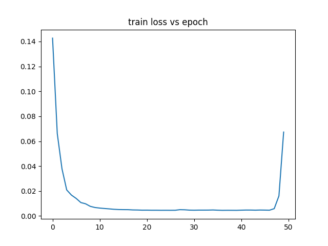
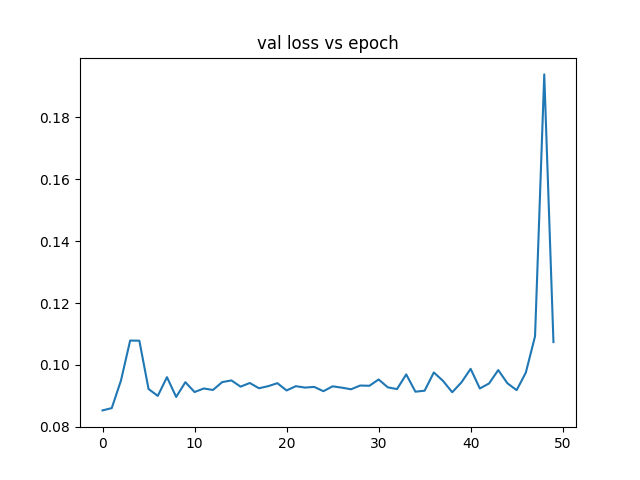
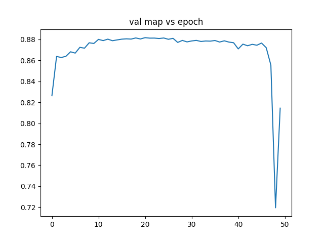
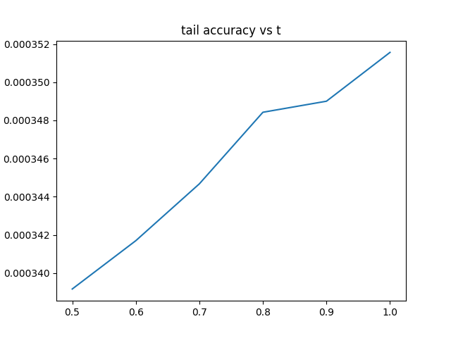

# PascalVOC Challenge with GUI

We achieved MAP of 0.84430 on the test set on the [VOCPascal 2012 Object Classification Competition (comp2)](http://host.robots.ox.ac.uk/pascal/VOC/). We have published our model which is number 20 on the global leaderboard and wrote a GUI to visualize the data. Our model is a Pytorch model Resnet 50 with transfer learning (pretrained on Imagenet data). Since this is a 20 class classification problem, we replaced the final fully connected (fc) layer with a 20 output fc layer.  We implemented our own loss, a 20 class binary cross entropy loss(BCE) to fit this problem which is implemented using Pytorch [BCEWithLogitsLoss](https://pytorch.org/docs/stable/_modules/torch/nn/modules/loss.html). We do not have any learning rate schemes, however, we did quite a bit of feature augmentations in our model. During training, we enlarged the image to be 400x400, which is then followed by a five crop and normalization. During inference, we enlarged the image to 280x280, performed a five crop and normalization. Our 5 crop uses the max function instead of mean. The idea is that there can be objects at different corner of the image that the center crop would miss. To choose our best model parameters, we saved the model with the lowest validation loss over 50 epochs. 

# Hyperparameters used in evaluation
Learning rate = 0.1  
Optimizer - Stochastic gradient descent only on layer 4 and fc layer, momentum = 0.9, weight decay =1e-4  

# Results:
  
Accuracy is not a good measure for this problem because there are more pictures without the object then images with the object. Hence the accuracy can easily be made very high for each class, as an easy classifier could just don’t predict any labels for any datapoints and still have a high accuracy. However for average precision, it is true positive over predicted positive so the measure would be more representative of the performance of the neural network. We implemented mAP based on this [Medium article](https://medium.com/@hfdtsinghua/calculate-mean-average-precision-map-for-multi-label-classification-b082679d31be)

# Model Graphs:
1. 
2. 
3. 
4. 

# To use GUI:
1. place VOCdevkit in the static folder
2. `python app.py`
